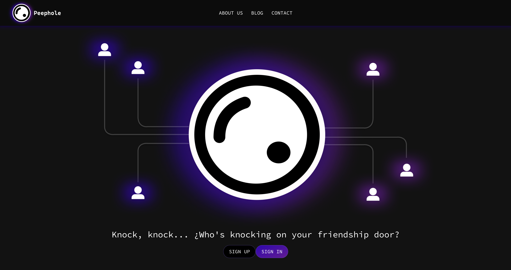
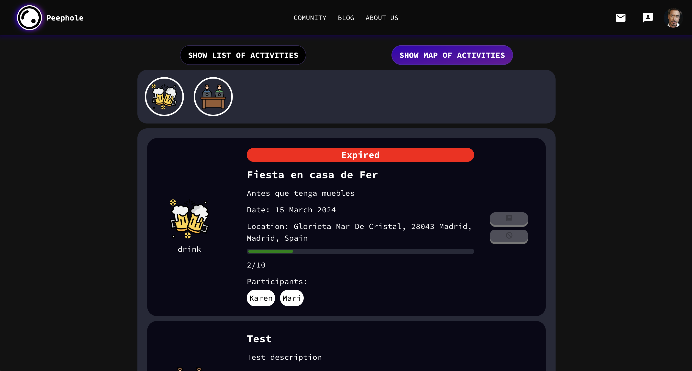
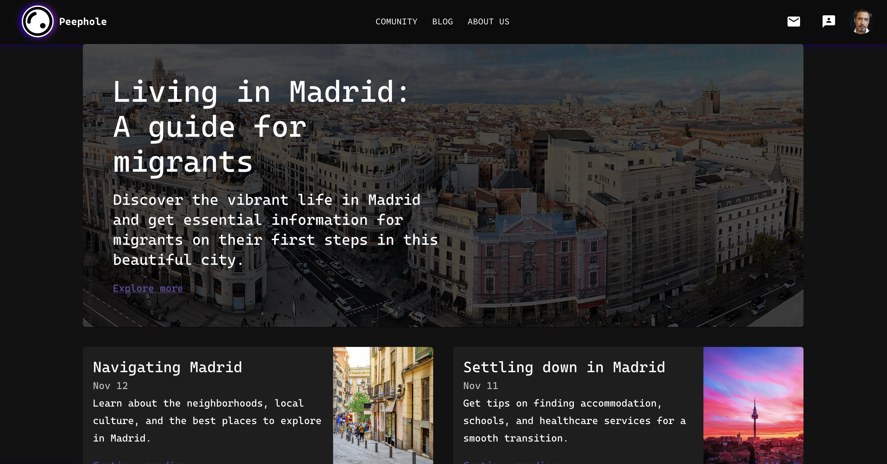
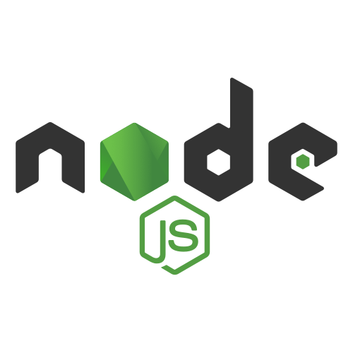

<div align="center">


# Final project of the master's degree in full stack development

</div>

We want to share with you our final master project that together with the learning obtained in [Nuclio Digital School](https://nuclio.school/), we developed an app based on topics that as a group we relate to and provide a solution so that any user can use it

## 💡 Description

[Peephole](https://nfsd-app-frontend.onrender.com/) is an app designed to facilitate the integration and socialization of migrants in a new city, Madrid being the first phase. The platform allows users to register, log in and connect with others who share similar interests. In addition, the app offers a community section where activities can be posted and booked, as well as a blog section with relevant information for the user.

## 🦾 Features

- **Profile registration:** Allows you to create a profile with the necessary information for app use.
- **User login:** The app allows you to log in or log out as an active user in the database.
- **Connection with different users:** A user can make friend requests with other users, the request arrives by a notification and allows to accept or ignore it.
- **Filter users:** The app allows a connected user to filter different profiles according to their interests.
- **Attend activities:** A user can see a list of activities which can be booked if available and also see the location on an interactive map.
- **Consult information:** The app contains an informative blog with different topics on migration and documentation as well as external events in the city.

## 🎮 Take a look at our app

### 🔗 Links

- [Peephole app](https://nfsd-app-frontend.onrender.com/) - Link to use the app
- [GitHub Front-End](https://github.com/PeepholeApp/NFSD_APP_FRONTEND) - Link to see the repository where the front-end development of the app is uploaded.
- [GitHub Back-End](https://github.com/PeepholeApp/NFSD_APP_BACKEND) - Link to see the repository where the back-end development of the app is uploaded.
- [Figma](https://www.figma.com/design/UfAyICqkQpBnN3Nh8pSuOH/PEEPHOLE?node-id=0-1&t=Ldpz6Ff0fiKX4DfI-0) - Design and multimedia content of the app

To enjoy our application without registering, copy and paste the following username and password:

#### User

```bash
prueba@gmail.com
```

#### Password

```bash
1234
```

### 📸 Screenshots

<div align="center">





</div>

## 💻 Stack

<div align="left">
    
    
    
    
    
    
    
    
    
    
    
</div>

## 🚀 Getting Started

To download, test and contribute to our application, the following step-by-step procedure must be followed

1. [Fork](https://github.com/PeepholeApp/NFSD_APP_FRONTEND/fork) or clone front-end repository.

```bash
git clone https://github.com/PeepholeApp/NFSD_APP_FRONTEND.git
```

2. Install the dependencies:

```bash
npm install
```

3. Run the development server:

   [Fork](https://github.com/PeepholeApp/NFSD_APP_BACKEND/fork) or clone back-end repository.

   ```bash
   git clone https://github.com/PeepholeApp/NFSD_APP_BACKEND.git
   ```

   Install the dependencies:

   ```bash
   npm install
   ```

   Run the server

   ```bash
   npm run dev
   ```

4. Run the app and open [**http://localhost:5173**](http://localhost:5173) with your browser to see the result

```bash
npm run dev
```

## 🙍‍♀️🙍‍♀️🙎‍♂️ Authors

- [Karen Noya](https://github.com/knoyag)
- [Maribel Alarcon](https://github.com/maribelalarcon)
- [Diego Martinez](https://github.com/DiegoMartinezRey)

## 📲 Social media

- [x](https://twitter.com/Peepholeapp_)
- [instagram](https://www.instagram.com/peepholeapp_/)
